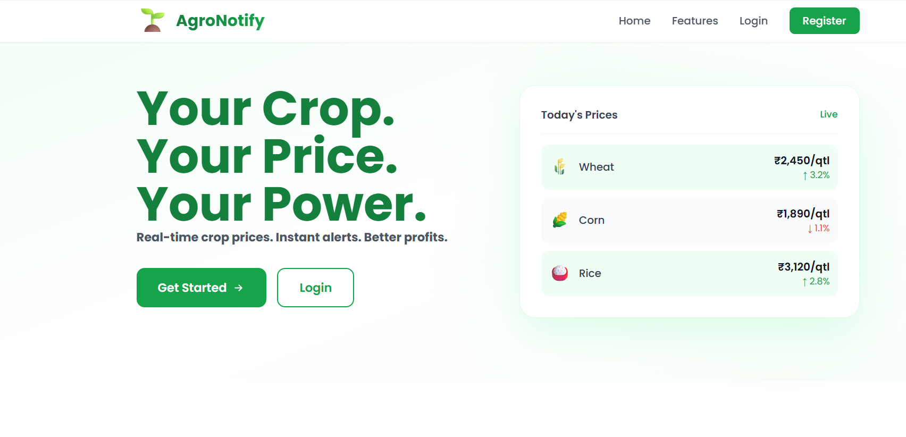

# AgroNotify 🌱

AgroNotify is a web application designed to help farmers track crop prices and market trends efficiently.

## 🚀 Features
- Crop price monitoring
- Simple and user-friendly interface
- Agriculture-focused insights

## 🛠️ Tech Stack
- HTML
- CSS
- JavaScript

## 📌 Future Improvements
- Real-time price updates
- Multi-language support (Marathi)
- Mobile responsiveness
- ## 📷 Preview

